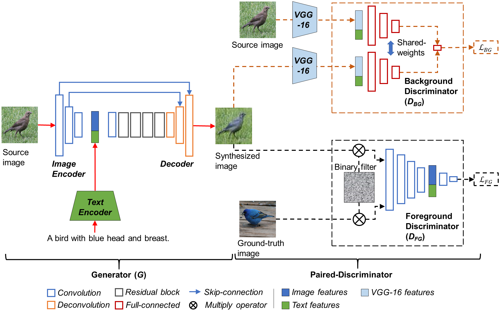
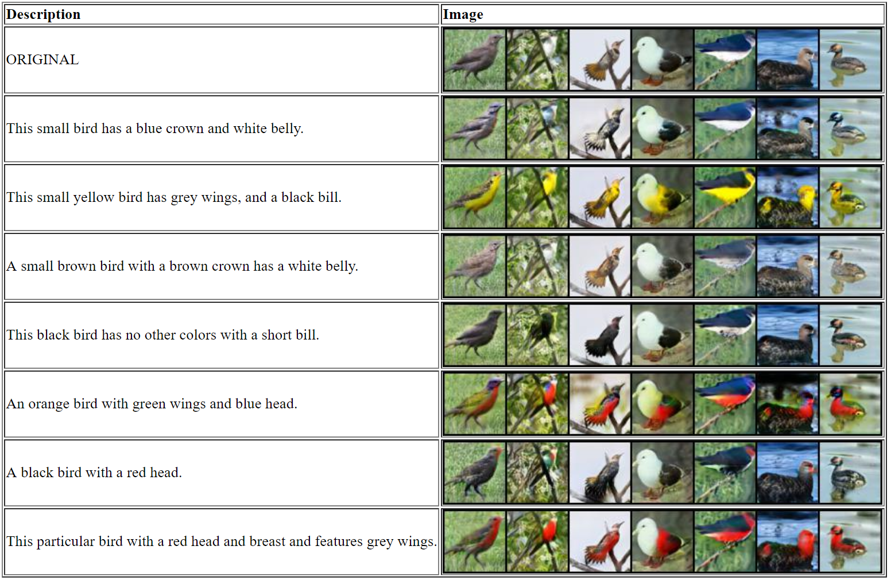
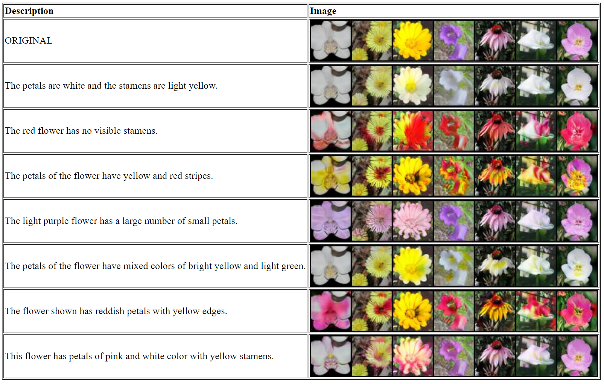

# Paired-D GAN for Semantic Image Synthesis

This is a PyTorch implementation of the paper "Paired-D GAN for Semantic Image Synthesis", ACCV 2018.



## Requirements
- [PyTorch](https://github.com/pytorch/pytorch) 0.4
- [Torchvision](https://github.com/pytorch/vision)
- [Pillow](https://pillow.readthedocs.io/en/4.2.x/)
- [fastText.py](https://github.com/salestock/fastText.py)
- [NLTK](http://www.nltk.org)

## Pretrained word vectors for fastText
Download a pretrained [English](https://s3-us-west-1.amazonaws.com/fasttext-vectors/wiki.en.zip) word vectors. You can see the list of pretrained vectors on [this page](https://github.com/facebookresearch/fastText/blob/master/pretrained-vectors.md).

## Datasets
- Oxford-102 flowers: [images](http://www.robots.ox.ac.uk/~vgg/data/flowers/102) and [captions](https://drive.google.com/file/d/0B0ywwgffWnLLMl9uOU91MV80cVU/view?usp=sharing)
- Caltech-200 birds: [images](http://www.vision.caltech.edu/visipedia/CUB-200-2011.html) and [captions](https://drive.google.com/file/d/0B0ywwgffWnLLLUc2WHYzM0Q2eWc/view?usp=sharing)

The caption data is from [this repository](https://github.com/reedscot/icml2016). 

## Pretrained models
- [Birds text embedding](https://drive.google.com/open?id=1kU3j0RhPpFXyi7CKTTCgSeBTND3P2y5B)
- [Flowers text embedding](https://drive.google.com/open?id=1uOglLT54T9tcoxuM0aCBd6xW5qiRcIhB)
- [VGG-16](https://drive.google.com/open?id=1iLX_-xJjX-FuKQJJJM2HE6MKKUXbhUZV)
- [Birds](https://drive.google.com/open?id=12TzCRpCSPRBmQ9dSR6d-qLkG_E6fOfXw)
- [Flowers](https://drive.google.com/open?id=1olZ0ViipY328dcG2QqBhEpG8gAPln_8Y)

## Run
- `scripts/train_text_embedding_[birds/flowers].sh`  
Train a visual-semantic embedding model using the method of [Kiros et al.](https://arxiv.org/abs/1411.2539).
- `scripts/train_[birds/flowers].sh`  
Train a GAN using a pretrained text embedding model.
- `scripts/test_[birds/flowers].sh`  
Generate some examples using original images and semantically relevant texts.

## Results




## Acknowledgements
- [Text to image synthesis](https://github.com/reedscot/icml2016)
- [StackGAN](https://github.com/hanzhanggit/StackGAN)
- [Semantic Image Synthesis via Adversarial Learning](https://github.com/woozzu/dong_iccv_2017), implemented by Seonghyeon Nam

## Citation
```
@inproceedings{duc2018Paired-D,
  author={Duc Minh Vo, Akihiro Sugimoto},
  title={Paired-D GAN for Semantic Image Synthesis},
  booktitle={ACCV},
  year={2018}
}
```
